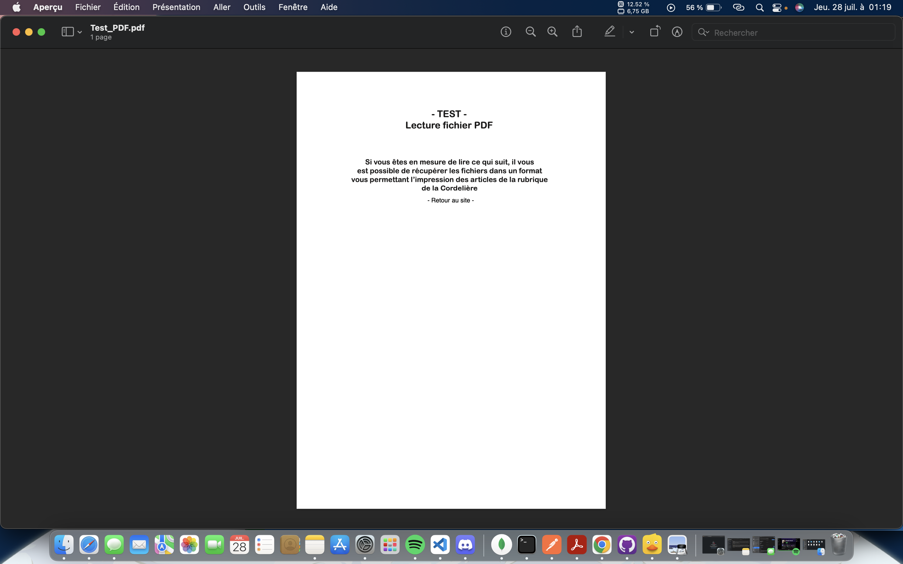

## **PDFTOPIC *By Ilyes-El-Majouti***
---
<br>

### **Documentation en français**
Ce package permet de convertir un PDF en n'importe quels formats d'image (png, jpg, gif, ...) en très bonne qualité. le package avec la meilleure qualité de rendu, après avoir essayé plusieurs packages les qualités de rendu était horrible du coup j'ai décidé de créer ce package qui ressoudera ce souci a plus d'une personne 😉.

Si vous voulez une version pour convertir avec express js envoyez moi un message sur github ou faite un issues pour me le faire savoir
### **Comment l'utiliser ?**
Avant tout il faut installer le package sur npm ou github avec la commande suivante
```sh
npm install pdftopic
```
Ensuite après avoir installé le package il vous suffira d'importer dans votre code Javascript la partie suivante pour cet exemple je souhaite convertir un fichier PDF en format PNG
```javascript
const { pdftobuffer } = require('pdftopic');
const fs = require('fs');

const pdf = fs.readFileSync('./ilyes.pdf', null);

pdftobuffer(pdf, 0).then((buffer) => {
    fs.writeFileSync('./ilyes.png', buffer, null);
})
```
### **Résultat après avoir exécuté le code**

Ensuite tu trouveras ton fichier converti avec ton extension pour ma part PNG

**Avant**



**Après**


#### **Vous retrouverez les fichiers sur le github (https://github.com/Ilyes-El-Majouti/pdftopic)**
<br>

### **Liker si vous avez aimé le code ça me ferait très plaisir 💪😉**

---
<br>

### **Documentation in English**
This package allows you to convert a PDF to any image formats (png, jpg, gif, ...) in very good quality. the package with the best rendering quality, after trying several packages the rendering qualities were horrible so I decided to create this package which will solve this problem for more than one person 😉.

If you want a version to convert with express js send me a message on github or do an issues to let me know

### **How to use it ?**
First of all you have to install the package on npm or github with the following command
```sh
npm install pdftopic
```
Then after installing the package, you just need to import the following part into your Javascript code. For this example, I want to convert a PDF file to PNG format.
```javascript
const { pdftobuffer } = require('pdftopic');
const fs = require('fs');

const pdf = fs.readFileSync('./ilyes.pdf', null);

pdftobuffer(pdf, 0).then((buffer) => {
    fs.writeFileSync('./ilyes.png', buffer, null);
})
```
### **Result after running the code**

Then you will find your converted file with your extension for my part PNG

**Before**


**After**


#### **You will find the files on the github (https://github.com/Ilyes-El-Majouti/pdftopic)**
<br>

### **Like if you liked the code it would make me very happy 💪😉**

---
<br>

### **Documentación en español**
Este paquete te permite convertir un PDF a cualquier formato de imagen (png, jpg, gif, ...) en muy buena calidad. el paquete con la mejor calidad de renderizado, después de probar varios paquetes las calidades de renderizado eran horribles, así que decidí crear este paquete que resolverá este problema para más de una persona 😉.

Si desea una versión para convertir con express js, envíeme un mensaje en github o haga un problema para avisarme
### **Comment l'utiliser ?**
En primer lugar, debe instalar el paquete en npm o github con el siguiente comando
```sh
npm install pdftopic
```
Luego, después de instalar el paquete, solo necesita importar la siguiente parte en su código Javascript para este ejemplo. Quiero convertir un archivo PDF a formato PNG.
```javascript
const { pdftobuffer } = require('pdftopic');
const fs = require('fs');

const pdf = fs.readFileSync('./ilyes.pdf', null);

pdftobuffer(pdf, 0).then((buffer) => {
    fs.writeFileSync('./ilyes.png', buffer, null);
})
```
### **Resultado después de ejecutar el código**

Luego encontrará su archivo convertido con su extensión para mí PNG

**Antes**


**Después**


#### **Encontrará los archivos en github (https://github.com/Ilyes-El-Majouti/pdftopic)**
<br>

### **Like si te gusto el código me haría muy feliz 💪😉**